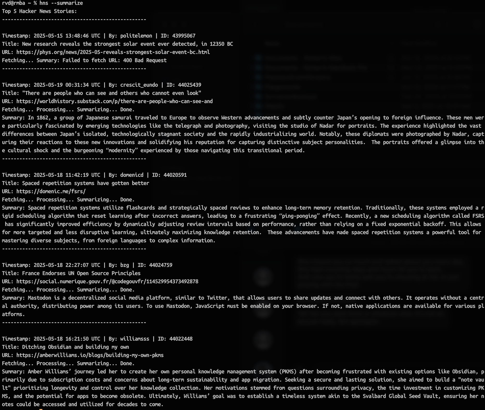

# hns - Hacker News Stories CLI

A command-line interface for fetching and displaying top stories from Hacker News.

`hns` is a simple, fast Rust command-line tool that pulls top stories from the official Hacker News API and displays them in a clean, readable format. The tool shows story titles, authors, timestamps, text content, and URLs in a structured way, making it easy to browse Hacker News without leaving your terminal.

## Features

- Fetch and display the top stories from Hacker News
- Configurable number of stories to display
- Clean formatting with proper handling of HTML content
- Special handling for "Show HN" posts
- Proper decoding of HTML entities
- AI-powered URL summarization using Ollama's gemma3:4b model

## Example
```
% hns summarize
```


## Installation

Ensure you have Rust and Cargo installed. Then:

```bash
# Clone the repository
git clone https://github.com/yourusername/hns.git
cd hns

# Build and install
cargo install --path .
```

### Summarization Dependencies

To use the `--summarize` feature, you need to have Ollama running with the gemma3:4b model installed:

1. [Install Ollama](https://ollama.ai/) following the official instructions
2. Pull the gemma3:4b model:
```bash
ollama pull gemma3:4b
```
3. Ensure Ollama is running before using the `--summarize` flag
```bash
# Start Ollama (keep running in a separate terminal)
ollama serve
```

## Usage

### Default Behavior

Run the tool with default settings (shows 5 top stories):

```bash
hns
```

### Subcommands

#### Show Stories (Default)

Show Hacker News stories with customizable options:

```bash
hns show                 # Show 5 stories (default)
hns show -m 10           # Show 10 stories
hns show --max-stories 25  # Show maximum 25 stories
```

#### Summarize Stories

Show Hacker News stories with AI-powered URL summaries:

```bash
hns summarize            # Show 5 stories with summaries
hns summarize -m 10      # Show 10 stories with summaries
```

#### Doctor Diagnostics

Run diagnostic checks to verify system setup:

```bash
hns doctor               # Check network connectivity and Ollama models
```

### Command-line Arguments

| Argument | Short | Description | Default | Range |
|----------|-------|-------------|---------|-------|
| `--max-stories` | `-m` | Maximum number of stories to display | 5 | 1-25 |
| `--help` | `-h` | Display help information | - | - |
| `--version` | `-V` | Display version information | - | - |

### Backward Compatibility

For backward compatibility, the following legacy commands still work:

```bash
hns -m 10                # Same as: hns show -m 10
hns --max-stories 25     # Same as: hns show --max-stories 25
hns --summarize          # Same as: hns summarize (deprecated)
```

#### Legacy Examples

Display the top 10 stories:

```bash
hns -m 10
```

Display the maximum number of stories:

```bash
hns --max-stories 25
```

Display stories with URL summaries (deprecated):

```bash
hns --summarize
```

Display 10 stories with URL summaries (deprecated):

```bash
hns -m 10 --summarize
```

## Output Format

For each story, the tool displays:

1. A separator line
2. Timestamp, author, and story ID
3. Story title
4. For "Show HN" posts: URL followed by text content (if available)
5. For regular posts: Text content (if available) or URL

## Development

### Prerequisites

- Rust 1.70.0 or higher
- Cargo

### Development Tools

The project includes several files to help with development:

- `Makefile` - Common development tasks (run `make help` for details)
- `CHANGELOG.md` - Track changes between versions
- `CONTRIBUTING.md` - Guidelines for contributors

### Dependencies

- `clap` - Command-line argument parsing
- `reqwest` - HTTP client for API requests (and Ollama API calls)
- `tokio` - Asynchronous runtime
- `serde` - JSON serialization/deserialization
- `serde_json` - JSON serialization/deserialization for Ollama API
- `chrono` - Timestamp formatting
- `scraper` - HTML parsing
- `ego-tree` - Tree data structure for HTML parsing
- `html2text` - HTML to text conversion for URL content

### Building from Source

```bash
# Clone the repository
git clone https://github.com/yourusername/hns.git
cd hns

# Build in debug mode
cargo build

# Build in release mode
cargo build --release
```

### Running Tests

```bash
cargo test
```

### Release Process

This project uses GitHub Actions for continuous integration and deployment. The workflow automatically:

1. Tests the codebase
2. Builds binaries for multiple platforms (Linux, macOS Intel/ARM, Windows)
3. Creates GitHub releases with packaged artifacts when tags are pushed
4. Publishes to crates.io when a new version is tagged

To create a new release:

```bash
# 1. Update the version in Cargo.toml
# 2. Commit the changes
git add Cargo.toml
git commit -m "Bump version to x.y.z"

# 3. Tag the commit
git tag -a vx.y.z -m "Release version x.y.z"

# 4. Push to GitHub with tags
git push && git push --tags
```

> **Note:** To enable publishing to crates.io, you must set the `CRATES_IO_TOKEN` secret in your GitHub repository settings.

## API

This tool uses the official Hacker News API:
- https://github.com/HackerNews/API

## License

This project is licensed under the BSD 3-Clause License - see the [LICENSE.md](LICENSE.md) file for details.
